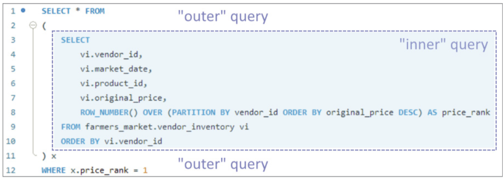
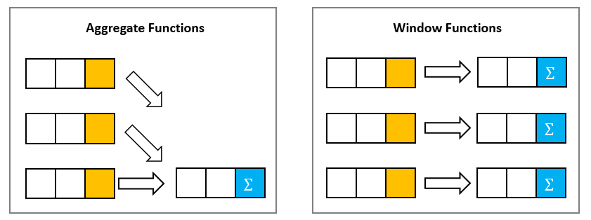
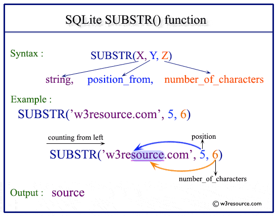

# Advanced SQL Techniques

```
$ echo "Data Sciences Institute"
```

---

# Advanced Techniques

- **NULL Management**
- **Windowed Functions**
- **String Manipulation**
- **UNION & UNION ALL**
- **INTERSECT & EXCEPT**

---

# NULL Management in SQL

Handling NULLs effectively:
- **IFNULL and COALESCE**: Substitute NULLs with specified values.
- **NULLIF**: Returns NULL if two expressions are equal, else returns the first expression.

---

# IFNULL/ISNULL (flavour dependent) and COALESCE
- `IFNULL` (sqlite) or `ISNULL` (most others) allows us to return a replacement value for NULLs
  - Replacement values can be another column, a calculated value, or static
      - e.g. when col1 is NULL, it is replaced with values from col2
          - values from col2 are only present if col1 is NULL
          - if col2 is NULL, then NULL will be returned

---

# IFNULL/ISNULL (flavour dependent) and COALESCE
      
- `COALESCE` does this as well, but behaves slightly differently
  - `COALESCE` allows you to replace NULLs from replacement values themselves
      - e.g. when col1 is NULL, it's replaced with col2; when col2 is NULL, it's replaced with col3, etc
  - `IFNULL` has to be wrapped around another (set of) `IFNULL` function(s) in order to mimic this behaviour
- Both are acceptable, `IFNULL` may be faster in some cases, though this isn't totally clear
  - `IFNULL` is also less flexible for mixed data types 

---

# IFNULL/ISNULL (flavour dependent) and COALESCE

(`IFNULL` & `COALESCE` live coding)

---

# NULLIF
- `NULLIF` is a useful, although perhaps uncommon, means of evaluating if two arguments are equal to one another: 
  - `NULLIF(5,5) AS [same], NULLIF(5,7) AS [different]`
  - It can be generally viewed as equivalent to: 
      - `CASE WHEN parameter_1 = parameter_2 THEN NULL ELSE expr1 END`
- `NULLIF` is particularly useful when embedded within aggregations
  - Consider checking whether employees received a bonus: 
      - `SELECT COUNT(NULLIF(Bonus, 0)) FROM Employees`
  - While these may also be possible within CASE statements, the readability is improved

---
# NULLIF

- Because it is NULL producing, it can be useful in combination with `COALESCE`
  - Consider comparing average budgets from year to year: 
      - `SELECT AVG(COALESCE(NULLIF(current_year, previous_year), 0.00)) FROM budgets`
- `NULLIF` can also help capture empty strings and turn them into NULLs
  - `NULLIF(col_with_blanks,'')`

---

# NULLIF

(`NULLIF` live coding)

---
with the end if Null Management comes:

# Windowed Functions

- Purpose

- OVER

- PARTITION BY

- ROW_NUMBER()

- Other Windowed Functions

---

# Purpose
- Windowed Functions allow us to create groupings within groupings ("partitions")
- Allow for greater complexity than simple SQL 
  - In Module 3, we mentioned briefly a rolling total, e.g. a `SUM` and a `COUNT`; windowed functions allow us to return these types of results=


- Image: Teate, Chapter 7 👉

---

# Purpose

- Often used with a subquery
  - One of the most common techniques is creating a row number `ROW_NUMBER()` per group
      - When combined with `ORDER BY`, the associated row number will be the _highest_ or _lowest_ per grouping
      - This allows you to select the min or max by setting the row number = 1 in the "outer" query (i.e. not the "inner" subquery)

---

# OVER

- Syntax for windowed function always requires the `OVER` clause
  - `{desired_windowed_function} OVER (ORDER BY [a column])`
- The `ORDER BY` clause is required
- Think of the `OVER` clause as applying the function of your choice
  - e.g. create row numbers based on the ordering of this column
  - e.g. rank these values from highest to lowest

---

# PARTITION BY

- Within an `OVER` clause, we can optionally use `PARTITION BY` to create groupings for the function to be applied to
  - `{desired_windowed_function} OVER (PARTITION BY [a column] ORDER BY [a column])`

---

# PARTITION BY

- Now, the function is being applied to different groups 
  - e.g. rank these values from highest to lowest within these groups
      - The ranking will restart for each group
      - Think of this like the Olympics: the top three competitors for each event get gold, silver, and bronze — the `PARTITION BY` is the event, the `ORDER BY` is the time `ASC` or points `DESC` that determine the outcome of the event

---

# PARTITION BY

- Both the `PARTITION BY` and `ORDER BY` arguments can take more than one column
  - e.g. life expectancy by country by continent 



Image: SQLiteTutorial.net

---

# ROW_NUMBER()

- `ROW_NUMBER()` is the simplest windowed function, but also one of the most useful
  - There are no mathematical functions being applied, just an incremental value by group
  - Determining the top (or bottom) per group is often done through `ROW_NUMBER()`

- `ROW_NUMBER()` might feel a bit like ranking `RANK()`...but it's not quite
  - **What is the difference between `ROW_NUMBER()` and `RANK()`?** `r structure("\U1F4AD", class = "emoji")``r structure("\U1F4AC", class = "emoji")`**Think, Pair, Share**

---

# Other Windowed Functions
- SQL supports quite a few other windowed functions
- `NTILE` for example will assign rows to buckets (4: quartile, 5: quintile, 10: decile, etc)
  - As such, the `NTILE` function requires an argument passed to it
      - `NTILE(4) OVER (PARTITON BY...ORDER BY...)`
- `LAG` and `LEAD` allow us to create an offset of another column
  - e.g. show a previous_year_total next to a current_year_total for easy comparison

---
# Other Windowed Functions

- Knowing how and why to use these can make querying a lot easier


Image: SQLiteTutorial.net 👉

---

# Windowed Functions

(Windowed Functions live coding)

---

### Windowed functions are hard! What questions do you have about them?

--- 

# String Manipulation

-  LTRIM & RTRIM
-  REPLACE
-  UPPER & LOWER
-  Concatenation
-  SUBSTR
-  INSTR
-  LENGTH
-  CHAR & UNICODE
-  REGEXP

---

# LTRIM & RTRIM

`LTRIM` and `RTRIM` serve two purposes in SQLite.
1. Their main function is to remove leading or trailing white spaces from strings
    - This is surprisingly common — many SQL databases are populated by human input, and this is a frequently overlooked input error
    - e.g. '    Thomas Rosenthal    '

---

# LTRIM & RTRIM   

2. Alternatively, they act similarly to `REPLACE` (coming up next), but within their specific context:
    - `LTRIM` removes any specified set of characters from the _left_
    - `RTRIM` removes any specified set of characters from the _right_
        - The usefulness of this is going to be very case specific:
            - e.g. wanting to remove a prefix/suffix of an ID: 
                - `LTRIM("A189A", 'A')` would result in '189A'
                - `RTRIM("A189A", 'A')` would result in 'A189'
                - `REPLACE` would remove both A's: '189'
---

# LTRIM & RTRIM

(`LTRIM` & `RTRIM` live coding)

---

# REPLACE
- `REPLACE` is likely going to be one of your most commonly used string manipulations
- It substitutes a character or set of characters with another
  - We specify which string (or set of strings within a column), what we want to replace, and the replacement value
      - e.g. `REPLACE('A is an excellent instructor','instructor','TA')` results in 'A is an excellent TA'
  - You can also replace a character with nothing, using an empty string: `''`
      - e.g. `REPLACE('colour','u','')` results in 'color'

---

# REPLACE

- `REPLACE` statements can be strung together — the innermost function will be executed first
  - e.g. `REPLACE(REPLACE(REPLACE(REPLACE('A?lot-of,punctuation.','.',' '),',',' '),'-',' '),'?',' ')` results in 'A lot of punctuation'

---

# REPLACE

(`REPLACE` live coding)

---

# UPPER & LOWER
- `UPPER` forces all string characters to be uppercase
- `LOWER` forces all string characters to be lowercase
- Both `UPPER` and `LOWER` are essential for filtering tables based on strings
  - It's always best to assume that there is some string variety
  - Sometimes a `LIKE` statement will not be an option

---

# UPPER & LOWER

| annoying_string_column |
|------------------------|
| WORD                   |
| Word                   |
| word                   |
| wOrD                   |
| DifferentWord          |


---

# UPPER & LOWER

- We can always use `UPPER` or `LOWER` in a `WHERE` clause, even without using the commands in the `SELECT` statement

```
   SELECT annoying_string_column
   FROM table
   WHERE LOWER(annoying_string_column) = 'word'
```   
- _(This is also true for all of these string manipulations!)_

---

# UPPER & LOWER

(`UPPER` & `LOWER` live coding)

---

# Concatenation (sometimes CONCAT, flavour dependent )

- String concatenation combines two or more columns into a single column
- Concatenation can handle non-column values too
  - e.g. `first_name || ' ' || last_name as full_name` 
  - Or  `last_name || ', ' || first_name AS full_name`
- In SQLite, `CONCAT` is replaced by two vertical bar characters: `||`
  - Most other flavours use `CONCAT`
- By default, spaces are not included between columns 
  - i.e. you need to add a blank space between quotes

---

# Concatenation

(Concatenation live coding)

---

# SUBSTR ("substring")
- `SUBSTR` specifies any section of a string to return, based on:
  - Which string (i.e. column)
  - Where to begin the section (i.e. the string position to start, as an integer)
  - The (optional) number of characters to return (i.e. how far to go, as an integer)

---

# SUBSTR ("substring")

- `SUBSTR` replaces flavour specific functions like `LEFT` or `RIGHT`
  - By default `SUBSTR` counts from the left
      - e.g. `substr('a long string', 3, 4)` will return "long"
  - To count from the right, specify a negative number to start
      - e.g. `substr('a long string', -6, 6)` will return "string"

---

# SUBSTR ("substring")


     
- Image: www.w3resource.com/sqlite/core-functions-substr.php 👉

---

# SUBSTR

(`SUBSTR` live coding)

---

# INSTR (CHARINDEX flavour dependent)

- `INSTR` provides the starting position or location of a specified string
- `INSTR('The instructor is named Thomas','Thomas')` will result in 25, because "Thomas" is the 25th through 30th character in our string
  - `INSTR('The Instructor is named Thomas','Th')` will result in 1 because "Th" arises in "The" before "Thomas"

- `INSTR` can help with splitting a text string on delimiters
  - By finding the distance between delimiters and extracting the appropriate characters with `SUBSTR` we can move through delimiters in text columns
  - The code get's a wild quite quickly:

---

# INSTR (CHARINDEX flavour dependent)

```
SELECT 
 SUBSTR('FirstWord, SecondWord, ThirdWord',0, INSTR('FirstWord, SecondWord, ThirdWord',',')) as FirstDelim
,SUBSTR('FirstWord, SecondWord, ThirdWord', 
  INSTR('FirstWord, SecondWord, ThirdWord',',')+1,
  INSTR('FirstWord, SecondWord, ThirdWord',',')+1) as SecondDelim
,SUBSTR('FirstWord, SecondWord, ThirdWord',
  INSTR(
    (SUBSTR('FirstWord, SecondWord, ThirdWord',
    INSTR('FirstWord, SecondWord, ThirdWord',',')+1))
  ,',') + 
  INSTR('FirstWord, SecondWord, ThirdWord',',')+1) AS ThirdDelim
```

---
# INSTR

(`INSTR` live coding)

---

# LENGTH
- `LENGTH` returns the number of characters in a given string (or set of strings in a column)
  - `LENGTH` also works on integers 
- `LENGTH` is perhaps less of a string manipulation in and of itself, but is useful in debugging 
  - Combined with `MAX`, `LENGTH` can be useful, especially when adding string length constraints to a column
  - Combined with `SUBSTR`, `LENGTH` can cut strings within a column by a dynamic value

- **What happens when we apply `SELECT SUBSTR(CanadianMusicians, 0, LENGTH(CanadianMusicians)-6)` to table 1?**

---

# LENGTH

| CanadianMusicians - Table 1 | CanadianMusicians - Table 2|
|-------------------|-------------------|
| Neil Young        | Neil              |
| Leonard Cohen     | Neil              |
| Shania Twain      | Leonard           |
| Michael Bublé     | Michael           |

---

class: top, left, inverse
# LENGTH

(`LENGTH` live coding)

---

# CHAR
- When provided an ASCII value, `CHAR` will return the appropriate character from the [ASCII table](https://www.asciitable.com/)
  - e.g. `CHAR(98)` will result in 'b'
- Pronunciation is split on "char": 
    - "char" as in "_char_-broiled"
    - "char" as in "_car_" 
    - "char" as in "*char*acter"
    - "char" as in "_care_"
---

# CHAR
- `CHAR` is hugely useful with `REPLACE`
  - Occasionally, line breaks affect SQL column validity, so `REPLACE(lf_column,CHAR(10),'')` and/or `REPLACE(cr_column,CHAR(13),'')` will be hugely useful
      - Where `CHAR(10)` is a linefeed "lf" and `CHAR(13)` is a carriage return "cr"
- `CHAR` can help with structure and control of strings as they flow into columns

---

# UNICODE (ASCII in some flavours)
- `UNICODE` provides the ASCII value of any given character
  - i.e. the opposite of `CHAR`
- The usage? I'm a bit unsure! Maybe faster than looking it up online?
  - e.g. `UNICODE('b')` will result in '98'

---


# CHAR & UNICODE

(`CHAR` & `UNICODE` live coding)

---

# REGEXP (flavour dependent)
- `REGEXP` allows for string filtering based on regular expressions (regex)
- Situated within a `WHERE` clause, very similar to `LIKE`
- Can use either SQL's or regex's Boolean operators
  - e.g. `WHERE austen_books REGEXP '(sion|ice)$'`
  - Or   `WHERE austen_books REGEXP 'sion$' OR book_title REGEXP 'ice$'`
---

# REGEXP (flavour dependent)

| Austen Books - Table a     | Austen Books - Table b |
|----------------------------|------------------------|
| Sense & Sensibility        | Pride & Prejudice      |
| Pride & Prejudice          | Persuasion             |
| Mansfield Park             |                        |
| Emma                       |                        |
| Persuasion                 |                        |
| Northanger Abbey           |                        |

---

# REGEXP (flavour dependent)

(Quick `REGEXP` live coding)

> "Some people, when confronted with a problem think: 'I know, I'll use regular expressions.' Now they have two problems."
> - Jamie Zawinski (probably)

---

### LOWER(wHaT qUeStIoNs dO yOu hAvE?)

---
# UNION & UNION ALL

- `UNION` and `UNION ALL` combine the results of two or more queries vertically (i.e. row-wise)
- `UNION ALL` keeps duplicate values, whereas `UNION` removes them
  - The difference between the two is one of the most common interview questions!

---
# UNION & UNION ALL

- `UNION` and `UNION ALL` require both/all queries to have the same number of columns 
  - You could `UNION` unrelated columns if you had a specific use-case for it
      - Column names will come from the first query
  - In situations where you don't have exactly the same columns, but still need to `UNION`, you can pass a `NULL` (or zero, or blank) column
      - Similarly, you can pass a string character to keep track of which data is associated to which query

---
# UNION & UNION ALL

```
  SELECT number_of_chips, number_of_tacos, 0 AS number_of_burritos, 'lunch' AS meal
  FROM lunch
  
  UNION
  
  SELECT NULL as number_of_chips, number_of_tacos, number_of_burritos, 'dinner' AS meal
  FROM dinner
```

---

# UNION & UNION ALL

- If we recall SQLite's lack of support for `FULL OUTER JOINS`, `UNION ALL` will allow us to emulate one:

```
  SELECT s1.quantity, s1.costume, s2.quantity
  FROM store1 s1
  LEFT JOIN store2 s2 ON s1.costume = s2.costume
  
  UNION ALL

  SELECT s1.quantity, s2.costume, s2.quantity
  FROM store2 s2
  LEFT JOIN store1 s1 ON s2.costume = s1.costume
  
  WHERE s1.quantity IS NULL
```

---

# UNION & UNION ALL

(`UNION` & `UNION ALL` live coding)

---

### What

### Questions 

### Do You have

### ?

---

# INTERSECT & EXCEPT

- Both `INTERSECT` and `EXCEPT` require both/all queries to have the same number of columns 

---

# INTERSECT
- `INTERSECT` returns data in common with both/all `SELECT` statements
- Values returned will be distinct
- **What's the difference between `INTERSECT` and `INNER JOIN`?**

---

# EXCEPT
- `EXCEPT` returns the opposite of an `INTERSECT`
  - for whatever rows are returned by the first `SELECT` statement, `EXCEPT` will return rows that were _not_ returned by the second `SELECT` statement
- The "direction" of `EXCEPT` matters a lot
  - `EXCEPT` is relative the the first `SELECT` statement, so changing which comes first will always change the results of the query

---

# INTERSECT & EXCEPT

Let's consider an example:

| product      | product_id |
|--------------|------------|
| blue bike    | 1          |
| tiger onesie | 2          |
| house plant  | 3          |
| headphones   | 4          |


| order_id | product_id |
|----------|------------|
| 1        | 1          |
| 2        | 1          |
| 3        | 1          |
| 4        | 4          |


---

# INTERSECT & EXCEPT

`INTERSECT` will find all products with work orders
        
```
SELECT product_id FROM product
INTERSECT
SELECT product_id FROM orders
```
Resulting in product_id's 1 & 4

---

# INTERSECT & EXCEPT

`EXCEPT` will find all products _without_ work orders

```
SELECT product_id FROM product
EXCEPT
SELECT product_id FROM orders
```

Resulting in product_id's 2 & 3

_OR_ all work orders _without_ products

```
SELECT product_id FROM orders
EXCEPT
SELECT product_id FROM product
```

Resulting in nothing (because no orders have a product_id that is not found in the product table)

---

# INTERSECT & EXCEPT

(`INTERSECT` & `EXCEPT` live coding)

---

### What questions do you have about anything from today?